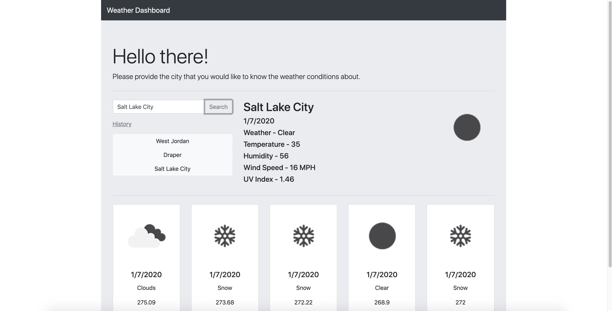

# 06-Weather-Dashboard

## Overview

The purpose of this application is to provide a user with the weather conditions of a location that they search.

### Gallery

Start Page:

### Problem

Currently ... none as far as the main requirements go, I don;t like how I made the code layout but its all funcitional.

### Solution

My solution will to implement better coding practices later on to make sure I understand their concepts

## Tech and Features Used

* HTML
* CSS
* Bootstrap
* Javascript
* Library API

## How to use

Simply input a city name and you will be given the current weather and 5 day forecast for that city. You can provide the county as long as you include a comma after the city name. (ex London, England)

Link to example readme:

https://braydon-nelson.github.io/06-Weather-Dashboard/
